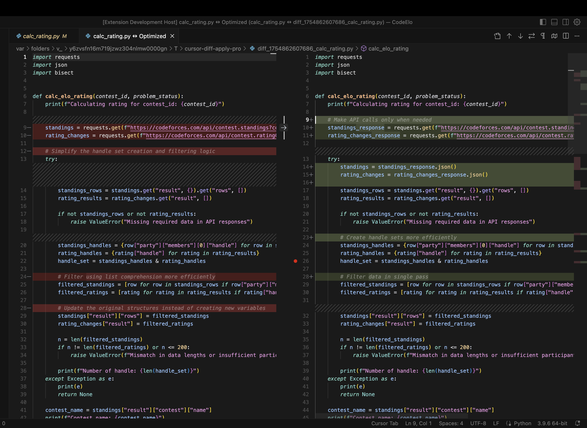

# Cursor Diff Apply Pro

AI-powered code optimization extension for Cursor.



## Setup (Dev Mode)

### Prerequisites
- OpenRouter API key from https://openrouter.ai
- Morph API key from https://morphllm.com

### Installation
```
git clone git@github.com:RiddleHe/cursor-diff-apply.git
cd cursor-diff-apply
npm install
npm run compile
```

### Running the Extension
1. Press `Cmd+Shift+p` on Mac and type `Debug: Start Debugging` to open the extension host
2. Press `Cmd+,` to open the settings and search `diff-apply-pro`
3. Add API keys

## Usage

### Workflow
1. Open any Javascript/Typescript/Python file
2. Press `Cmd+Shift+O`to analyze code and see comparisons in the diff viewer
3. Review changes in the diff viewer
4. PRess `Cmd+Shift+A` to apply or click 'cancel' to cancel
5. File is automatically saved with optimizations